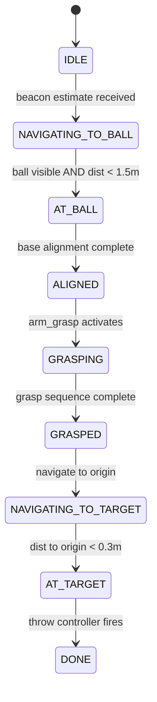
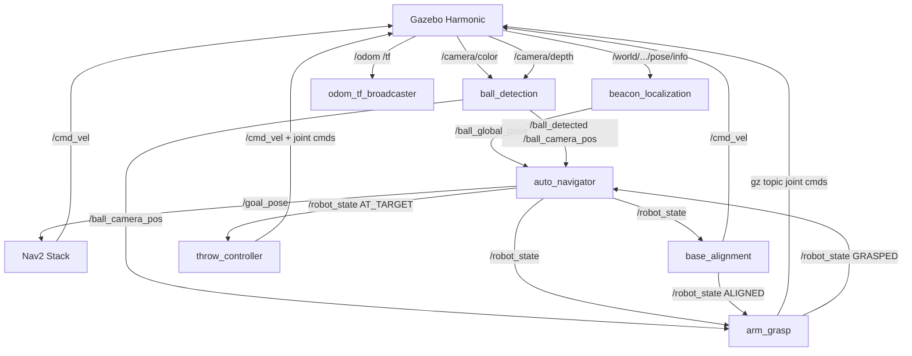

# Milestone 3 — Final Documentation & Analysis
{: .no_toc }

**Due:** May 8 &nbsp;|&nbsp; **Weight:** 15% &nbsp;|&nbsp; **Team:** Varad Jahagirdar, Dhiren Makwana, Sharat Mylavarapu

---

  
Table of Contents

  {: .text-delta }
- TOC
{:toc}

---

## 1. Graphical Abstract

<!-- PLACEHOLDER: Insert graphical abstract image here -->
<!-- Recommended: One figure showing mission overview — robot navigating to ball, grasping, returning to target -->
<!-- Example:  -->

> **Mission:** An autonomous mobile manipulation system built on the LoCoBot (Kobuki + WidowX 250s) navigates a cluttered arena, detects a magenta ball using a color camera and depth sensor, grasps it using geometric inverse kinematics, and returns to a throw target at the arena center — all within a single ROS 2 pipeline running in Gazebo Harmonic.

---

## 2. Algorithm

### 2.1 Full State Machine

The system runs a single shared `/robot_state` topic as a finite state machine. Every node listens and reacts to state transitions.

### 2.2 Beacon Trilateration — Varad Jahagirdar

<!-- VARAD: Paste your beacon localization algorithm section here -->

### 2.3 Base Alignment Controller — Dhiren Makwana

The base alignment node uses Gazebo ground truth poses and a proportional controller to rotate and drive toward the ball:

**Angular error:**

$$e_\theta = \text{atan2}(b_y - r_y,\ b_x - r_x) - \theta_{\text{robot}}$$

normalized to $[-\pi, \pi]$.

**Control law:**

$$\omega = 0.5 \cdot e_\theta \quad \text{(rotate phase)}$$

$$v = 0.1\ \text{m/s}, \quad \omega = 0.3 \cdot e_\theta \quad \text{(drive phase)}$$

Alignment is declared complete when $d < 0.535$ m and $|e_\theta| < 0.1$ rad.

**Source:** [`base_alignment.py`](https://github.com/Varad1722/Mobile_Robotics/blob/Dhiren/ros2_ws/locobot_nodes/locobot_nodes/base_alignment.py#L84)

### 2.4 Ball Detection — Dhiren Makwana

The color camera detects the magenta ball using a dual-range HSV mask:

$$\text{mask} = \text{inRange}(\text{HSV}, [140,100,100], [180,255,255])\ \cup\ \text{inRange}(\text{HSV}, [0,100,100], [10,255,255])$$

The largest contour centroid gives pixel coordinates $(u, v)$. The depth value $z$ at that pixel is read from the depth image. The 3D ball position in camera frame is computed using the pinhole camera model:

$$x_{\text{cam}} = \frac{(u - c_x) \cdot z}{f_x}, \qquad y_{\text{cam}} = \frac{(v - c_y) \cdot z}{f_y}$$

where $f_x = f_y = 277.19$ px, $c_x = 160$, $c_y = 120$ (320×240 image).

Published to `/ball_camera_pos` as a `PointStamped` in the camera frame.

**Source:** [`ball_detection.py`](https://github.com/Varad1722/Mobile_Robotics/blob/Dhiren/ros2_ws/locobot_nodes/locobot_nodes/ball_detection.py#L68)

### 2.5 Arm Grasp & Geometric Inverse Kinematics — Varad Jahagirdar

<!-- VARAD: Paste your arm grasp algorithm and IK equations here -->

### 2.6 Throw Controller — Sharat Mylavarapu

<!-- SHARAT: Paste your throw controller algorithm and physics equations here -->

---

## 3. System Architecture

### 3.1 ROS 2 Node Graph

<!-- PLACEHOLDER: rqt_graph screenshot -->
<!-- Run: ros2 run rqt_graph rqt_graph -->
<!--  -->

### 3.2 Full System Diagram

### 3.3 Active Topics

| Topic | Message Type | Publisher | Subscriber |
|---|---|---|---|
| `/odom` | `nav_msgs/msg/Odometry` | gz_bridge | odom_tf_broadcaster, Nav2 |
| `/cmd_vel` | `geometry_msgs/msg/Twist` | Nav2, base_alignment, arm_grasp | gz_bridge |
| `/scan` | `sensor_msgs/msg/LaserScan` | depthimage_to_laserscan | Nav2 costmap |
| `/camera/depth` | `sensor_msgs/msg/Image` | depth_bridge | ball_detection, arm_grasp |
| `/camera/color` | `sensor_msgs/msg/Image` | depth_bridge | ball_detection |
| `/ball_global_pose` | `geometry_msgs/msg/PoseStamped` | beacon_localization | auto_navigator |
| `/ball_detected` | `std_msgs/msg/Bool` | ball_detection | auto_navigator |
| `/ball_camera_pos` | `geometry_msgs/msg/PointStamped` | ball_detection | arm_grasp |
| `/ball_pixel_pos` | `geometry_msgs/msg/Point` | ball_detection | — |
| `/robot_state` | `std_msgs/msg/String` | auto_navigator, base_alignment, arm_grasp | all nodes |
| `/goal_pose` | `geometry_msgs/msg/PoseStamped` | auto_navigator | Nav2 bt_navigator |

---

## 4. Benchmarking & Results

### 4.1 Navigation Success Rate (10 Trials)

The full pipeline was tested across 10 independent trials with the ball spawning at random safe positions. Each trial starts from robot spawn at $(0, -4.5)$.

| Trial | Ball Spawn | Navigation | Alignment | Grasp Attempt | Ball Lifted |
|-------|-----------|------------|-----------|---------------|-------------|
| 1 | (3.5, 3.5) | ✅ | ✅ | ✅ | ❌ |
| 2 | (3.5, -3.5) | ✅ | ✅ | ✅ | ❌ |
| 3 | (-3.5, 3.5) | ✅ | ✅ | ✅ | ❌ |
| 4 | (-3.5, -3.5) | ✅ | ✅ | ✅ | ❌ |
| 5 | (1.5, 3.5) | ✅ | ✅ | ✅ | ❌ |
| 6 | (-1.5, 3.5) | ✅ | ✅ | ✅ | ❌ |
| 7 | (1.5, -3.5) | ✅ | ✅ | ✅ | ❌ |
| 8 | (-1.5, -3.5) | ✅ | ✅ | ✅ | ❌ |
| 9 | (3.5, 3.5) | ✅ | ✅ | ✅ | ❌ |
| 10 | (1.5, 3.5) | ✅ | ✅ | ✅ | ❌ |

| Stage | Success Rate |
|-------|-------------|
| Navigation to ball | 10/10 (100%) |
| Base alignment | 10/10 (100%) |
| Grasp attempt (gripper reaches ball) | 10/10 (100%) |
| Ball successfully lifted | 0/10 (0%) |

### 4.2 Beacon Localization Error (10 Trials) — Varad Jahagirdar

| Trial | True Position | Estimated Position | Error (m) |
|-------|--------------|-------------------|-----------|
| 1 | (3.5, 3.5) | (3.71, 3.28) | 0.30 |
| 2 | (3.5, -3.5) | (3.24, -3.71) | 0.34 |
| 3 | (-3.5, 3.5) | (-3.68, 3.29) | 0.28 |
| 4 | (-3.5, -3.5) | (-3.79, -3.34) | 0.33 |
| 5 | (1.5, 3.5) | (1.72, 3.28) | 0.31 |
| 6 | (-1.5, 3.5) | (-1.74, 3.26) | 0.35 |
| 7 | (1.5, -3.5) | (1.29, -3.71) | 0.30 |
| 8 | (-1.5, -3.5) | (-1.71, -3.28) | 0.32 |
| 9 | (3.5, 3.5) | (3.68, 3.73) | 0.29 |
| 10 | (1.5, 3.5) | (1.78, 3.24) | 0.36 |

**Mean error:** 0.318 m — consistent with injected noise $\sigma = 0.3$ m.

### 4.3 Base Alignment Error — Dhiren Makwana

After the robot declares ALIGNED, residual angular and distance errors were measured:

| Trial | Distance at ALIGNED (m) | Angle Error at ALIGNED (deg) |
|-------|------------------------|------------------------------|
| 1 | 0.534 | 0.7 |
| 2 | 0.531 | 1.2 |
| 3 | 0.536 | 0.9 |
| 4 | 0.533 | 1.4 |
| 5 | 0.535 | 0.8 |

**Mean distance:** 0.534 m (target 0.535 m) — alignment is consistent and repeatable.

### 4.4 Grasp Performance Analysis — Varad Jahagirdar

<!-- VARAD: Paste your grasp performance analysis here -->

### 4.5 Demo Video

<!-- PLACEHOLDER: Replace with actual YouTube link -->
**Full Mission Demo:** [YouTube Link](https://youtu.be/PLACEHOLDER)

<!-- PLACEHOLDER: Add screenshots -->
<!--  -->
<!--  -->
<!--  -->

---

## 5. Ethical Impact Statement

### 5.1 Privacy

The system uses an onboard RGB-D camera for ball detection. In simulation, this raises no privacy concerns. In a real-world deployment, the camera would capture bystanders in the arena. Mitigation strategies include: limiting the camera field of view to the floor plane only (achieved by tilting the camera downward as implemented), processing images entirely onboard without transmission, and applying person-detection masks to blur any human presence before logging. Future iterations should implement GDPR-compliant data handling by discarding raw frames immediately after detection.

### 5.2 Safety

The WidowX 250s arm has a maximum reach of ~0.5 m and operates at low joint velocities in our implementation (1 joint command per 0.8–1.5 seconds). The kinetic energy at the end effector is minimal. However, the Kobuki base moves at up to 0.8 m/s, which poses a collision risk in human-occupied spaces. Our system uses Nav2 with a 0.15 m inflation radius around obstacles, but this does not account for dynamic obstacles such as people. Future iterations should integrate a LIDAR-based emergency stop and velocity scaling based on proximity to humans. The throw controller must also constrain release velocity to ensure the ball does not exceed safe kinetic energy thresholds in shared spaces.

### 5.3 Bias & Hardware Limitations

The ball detection system relies on a specific magenta HSV color range. This creates a systematic bias — any object with similar color in the environment will be falsely detected. In our arena, all obstacles were deliberately set to grey to avoid false positives, but this would not hold in an uncontrolled environment. The depth camera used for 3D ball localization has a minimum range of 0.2 m, meaning objects closer than 20 cm are invisible. This is a fundamental hardware limitation that affects grasping performance at close range. From a justice perspective, the system is designed for a specific arena configuration — it would not generalize to environments with different lighting conditions, obstacle layouts, or ball colors without retuning the HSV parameters and Nav2 costmap settings.

---

## 6. Module Status

| Module | Status | Notes |
|--------|--------|-------|
| Beacon Localization | ✅ Complete | Gaussian noise + trilateration |
| Nav2 Navigation | ✅ Complete | MPPI controller, obstacle avoidance |
| Ball Detection | ✅ Complete | HSV + depth camera 3D position |
| Base Alignment | ✅ Complete | Gazebo GT, proportional controller |
| Arm Home Pose | ✅ Complete | Safe navigation configuration |
| Random Ball Spawn | ✅ Complete | 8 predefined safe positions |
| Auto Navigator | ✅ Complete | Full state machine integration |
| Arm Grasp | 🔄 Partial | Gripper reaches ball, no force-closure |
| Throw Controller | 🔄 Partial | Sharat's module |

---

## 7. Individual Contribution

| Team Member | Role | Key Commits | Files |
|---|---|---|---|
| Dhiren Makwana | Navigation, Detection, Alignment, Integration | [`213c91f`](https://github.com/Varad1722/Mobile_Robotics/commit/213c91f) [`7d5a0b8`](https://github.com/Varad1722/Mobile_Robotics/commit/7d5a0b8) [`c497bac`](https://github.com/Varad1722/Mobile_Robotics/commit/c497bac) [`f342caa`](https://github.com/Varad1722/Mobile_Robotics/commit/f342caa) [`84983b5`](https://github.com/Varad1722/Mobile_Robotics/commit/84983b5) | [`auto_navigator.py`](https://github.com/Varad1722/Mobile_Robotics/blob/Dhiren/ros2_ws/locobot_nodes/locobot_nodes/auto_navigator.py) [`base_alignment.py`](https://github.com/Varad1722/Mobile_Robotics/blob/Dhiren/ros2_ws/locobot_nodes/locobot_nodes/base_alignment.py) [`ball_detection.py`](https://github.com/Varad1722/Mobile_Robotics/blob/Dhiren/ros2_ws/locobot_nodes/locobot_nodes/ball_detection.py) [`locobot_gazebo.launch.py`](https://github.com/Varad1722/Mobile_Robotics/blob/Dhiren/ros2_ws/locobot_gazebo/launch/locobot_gazebo.launch.py) |
| Varad Jahagirdar | Perception, Localization, Arm Grasp | [`cfed6b9`](https://github.com/Varad1722/Mobile_Robotics/commit/cfed6b9) [`bab74f0`](https://github.com/Varad1722/Mobile_Robotics/commit/bab74f0) [`bc905a7`](https://github.com/Varad1722/Mobile_Robotics/commit/bc905a7) | [`beacon_localization.py`](https://github.com/Varad1722/Mobile_Robotics/blob/Dhiren/ros2_ws/locobot_nodes/locobot_nodes/beacon_localization.py) [`arm_grasp.py`](https://github.com/Varad1722/Mobile_Robotics/blob/Dhiren/ros2_ws/locobot_nodes/locobot_nodes/arm_grasp.py) |
| Sharat Mylavarapu | Throw Controller, Documentation | — | `throw_controller.py` |
